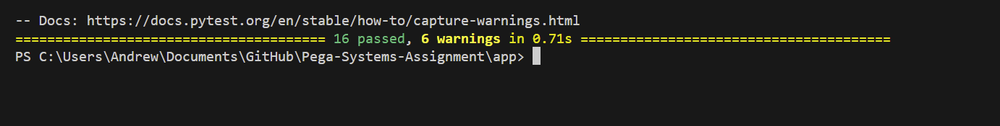
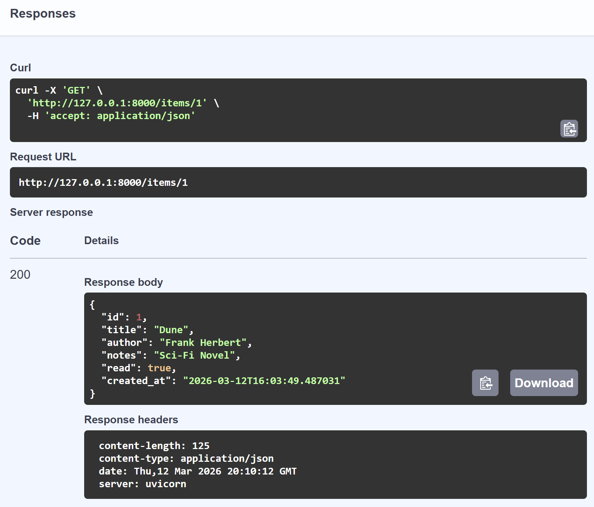
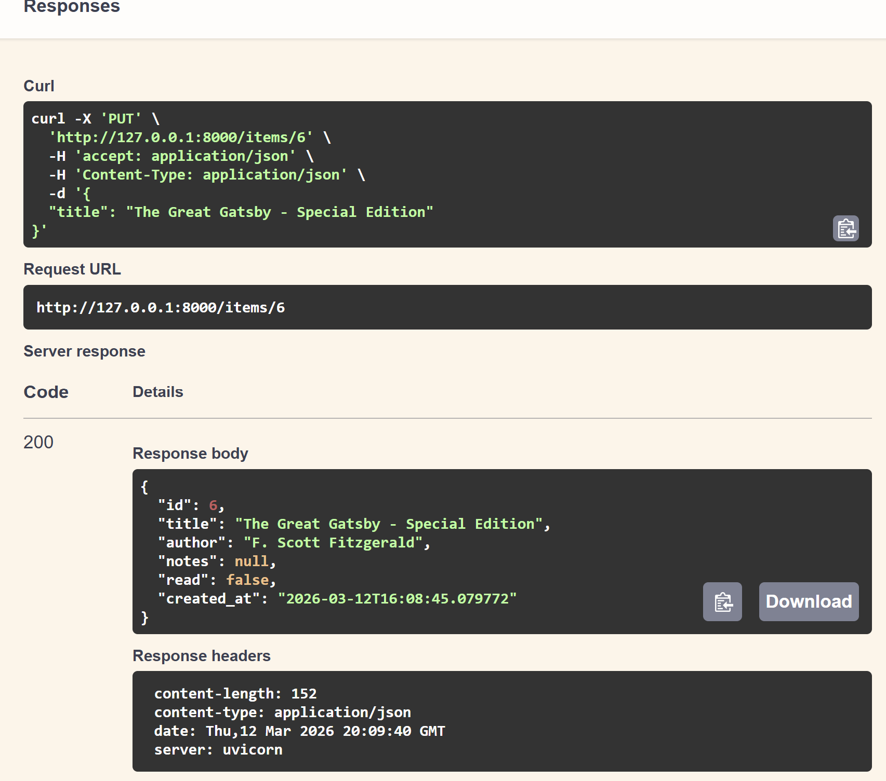
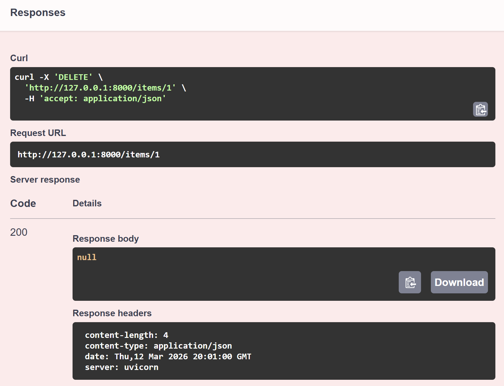
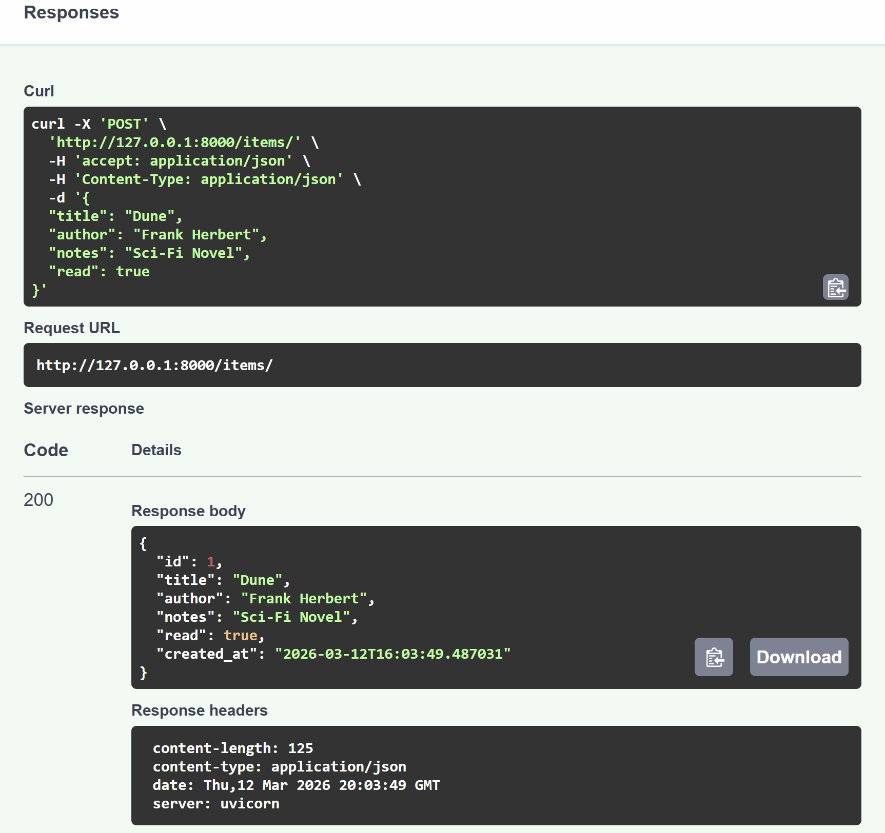
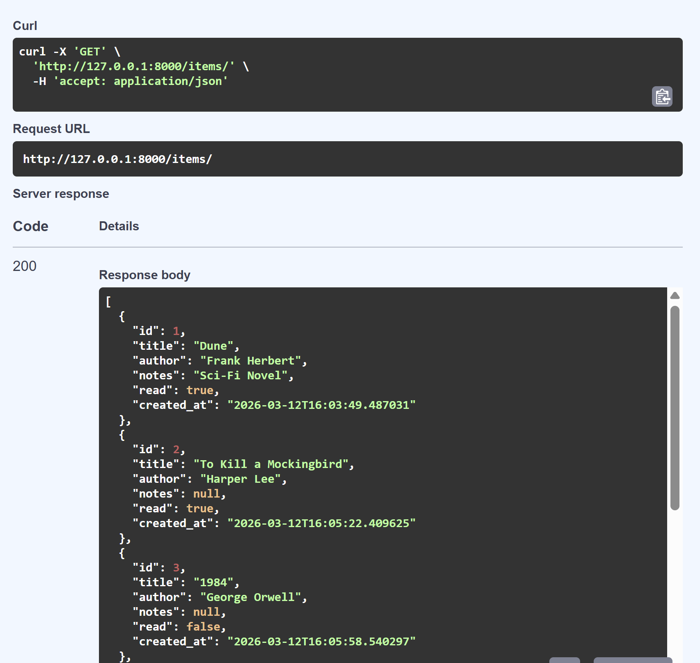
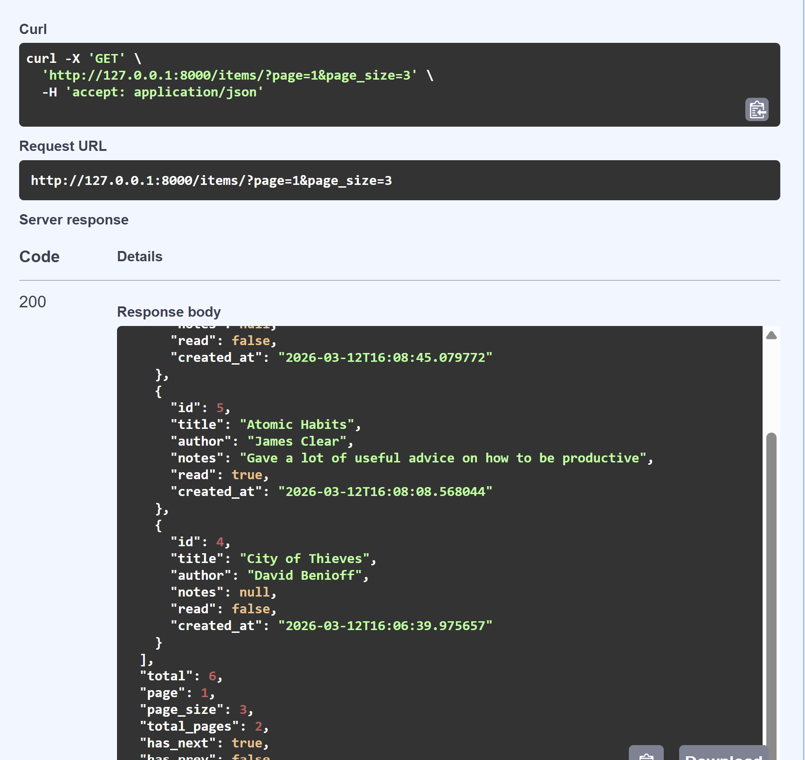

# Pega-Systems-Assignment

A small service for managing a reading list of books. Every book has:
  - title
  - author
  - notes
  - read/unread status (labeled as read)
  
Users can create, retrieve, update, and delete items from their reading list. 

---

## Table of Contents

* [Project Structure](#project-structure)
* [AI Usage](#ai-usage)
* [Tools Used](#tools-used)
* [Application Instructions](#application-instructions)
* [Testing](#testing)
* [Application Containerization](#application-containerization)
* [Route Results](#route-results)

---

## Project Structure

**Pega-Systems-Assignment/** ├── [README.md](./README.md)  
├── **app/** │&nbsp;&nbsp; ├── [main.py](./app/main.py)  
│&nbsp;&nbsp; ├── [schemas.py](./app/schemas.py)  
│&nbsp;&nbsp; ├── [models.py](./app/models.py)  
│&nbsp;&nbsp; ├── [database.py](./app/database.py)  
│&nbsp;&nbsp; ├── [logger.py](./app/logger.py)  
│&nbsp;&nbsp; ├── [config.py](./app/config.py)  
│&nbsp;&nbsp; ├── [Dockerfile](./app/Dockerfile)  
│&nbsp;&nbsp; ├── [.env](./app/.env)  
│&nbsp;&nbsp; ├── [app.log](./app/app.log)  
│&nbsp;&nbsp; ├── [reading_list.db](./app/reading_list.db)  
│&nbsp;&nbsp; ├── [requirements-pro.txt](./app/requirements-pro.txt)  
│&nbsp;&nbsp; ├── [requirements.txt](./app/requirements.txt)  
│&nbsp;&nbsp; ├── **routes/** │&nbsp;&nbsp; │&nbsp;&nbsp; └── [items.py](./app/routes/items.py)  
│&nbsp;&nbsp; └── **services/** │&nbsp;&nbsp; &nbsp;&nbsp;&nbsp; └── [item_service.py](./app/services/item_service.py)

---

## AI Usage

  - Recommended SQLite as database engine for project.
  - Recommended using Pydantic models to ensure proper formatting in responses and requests.
  - Recommended using SQLAlchemy to enable interactions between database and application.
  - Recommended using a config file to keep track of environment variables.
  - Taught me to use `Union` types to accept different return types, allowing the GET all items endpoint to work with or without pagination.
  - Recommended using logging to track data flow and potential issues.
  - Recommended writing tests to verify the application's functionality.
  - Taught me about `StaticPool`, which allows tests to run using a single shared in-memory connection, enabling testing while the application is running. 

---

## Tools Used

### Docker
Used to containerize the application, allowing it to run consistently across different operating systems or environments. 

### FastAPI
A high-performance web framework ideal for building small services such as this application. Uses asynchronous programming for speed and integrates seamlessly with Pydantic models for request/response validation. 

### Uvicorn
A fast, lightweight ASGI server for running FastAPI applications. Chosen for its compatibility with FastAPI and asynchronous support.

### SQLite
A lightweight, serverless relational database stored in a single file. Requires no setup, making it ideal for small projects. An in-memory version is used during testing to prevent modifying the main database. 

### Pydantic Models
Define the data structure of requests and responses. They validate input and output data automatically, reducing errors and simplifying API development.

### SQLAlchemy
An Object-Relational Mapper (ORM) that maps Python classes to database tables. Enables easy interaction between Python objects and the database, including automatic table creation, querying, and updates.

---

## Application Instructions

1. Download or clone the repository.

2. Open up the repository on an IDE (like Visual Studio Code)

3. Navigate to the app directory:
```bash
cd app
 ```
4. Install the dependencies:
```bash
pip install -r requirements.txt
```

5. Start the server:
```bash
python -m uvicorn main:app --reload
```

7. Copy the link given in the terminal:
```markdown
Example: http://127.0.0.1:8000
```
   
8. Open your browser and enter the link with `/docs` at the end:
```markdown
Example: http://127.0.0.1:8000/docs
```

9. **Using API Routes**

```markdown
All API routes are accessible via the Swagger documentation at `/docs` once the server is running. Here's how to interact with them:

1. Click down arrow to expand a route and press `Try it out`.

2. Enter required parameters:
  - **Get Item**: Enter `item_id`
   - **Update Item**: Enter `item_id` and the new values in the request body.
   - **Delete Item**: Enter `item_id`.
   - **Create Item**: Enter title, author, read status, and optional notes.
   - **Get All Items**: Optional `page` and `page_size` parameters for pagination.

3. Press **Execute** to see the response.

You can also use cURL or Postman to make requests to these endpoints.
```

---

## Testing

Unit tests ensure all routes and services work correctly without affecting the main database.

  - Tests use an **in-memory SQLite database** to isolate them from the main database.
  - A single shared connection (`StaticPool`) keeps the in-memory database alive throughout
  - Tests include:
    - Creating valid and invalid items
    - Updating and deleting items
    - Pagination behavior
    - Checking response data structure 

### Run Tests

1. Navigate to app directory:
   ```bash
   cd app
   ```
  
2. Execute the tests:
   ```bash
   python -m pytest
   ```


---

## Application Containerization 

**Using Docker**

1. Run the Dockerfile to build a Docker image:
   ```bash
   docker build -t my-app-name:v1 .
   ```

2. Run the container:
   ```bash
   docker run -d \
  -p 8080:3000 \
  -e DATABASE_URL=(get actual value from .env) \
  -e DEBUG=(True or False) \
  --name my-running-app my-app-name:v1
  ```

---

## Route Results

### Get Item Route




### Update Item Route




### Delete Item Route




### Create Item Route




### Get All Items Route




### Get All Items Route (With Pagination)


